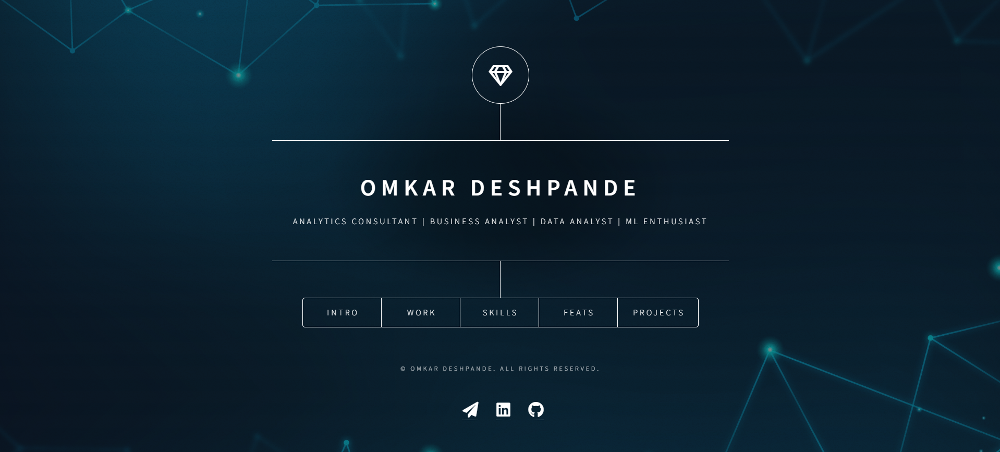
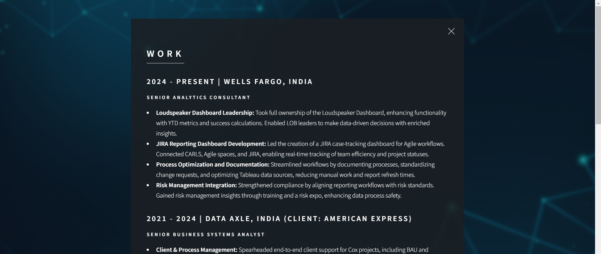

# Omkar Deshpande's Web Resume

Welcome to the repository for my **Web Resume**—a showcase of my skills, experience, and achievements as a data analytics professional. This web-based resume provides a comprehensive overview of my journey, featuring interactive sections such as my work history, achievements, skills, and projects.

---

## 🔗 **Live Demo**
[Check out the live version of my web resume here.](https://omkardeshpande23994.github.io/index.html)  

---

## 📝 **Features**
- **Intro Section**: A welcoming introduction highlighting my background and passion for data analytics.
- **Work Experience**: Detailed accounts of my roles at Wells Fargo, American Express, and more, showcasing impactful contributions.
- **Skills Section**: A categorized breakdown of my technical expertise in tools like Tableau, SQL, AWS, and Python.
- **Achievements**: A timeline of key recognitions and accomplishments throughout my career.
- **Projects**: Interactive cards for featured projects, including links to live demos and repositories.
- **Responsive Design**: Optimized for all devices, ensuring a seamless experience across desktops, tablets, and mobile screens.

---

## 💡 **Technologies Used**
- **HTML5**: Structure of the web resume.
- **CSS3**: Styling and layout, including responsive design for different screen sizes.
- **Font Awesome**: For icons (e.g., LinkedIn, GitHub, Email).
- **JavaScript**: Interactivity and functionality (where applicable).
- **GitHub Pages**: Hosting and deployment of the project.

---

## 📁 **File Structure**
```
/
├── assets/
│   ├── css/
│   │   ├── main.css           # Main stylesheet for layout and design
│   │   ├── fontawesome-all.min.css # Font Awesome icons
│   ├── js/
│   │   ├── main.js            # Script for interactive elements (if any)
│   └── images/                # Images used for the project
├── index.html                 # Main HTML file
└── README.md                  # Project documentation
```

---

## 🎯 **How to Deploy on GitHub Pages**
1. Push the project to your GitHub repository.
2. Go to the **Settings** tab of the repository.
3. Under the **Pages** section, select the branch (usually `main`) and root folder (`/`) for deployment.
4. Save the settings, and your site will be live at:
   ```
   https://<username>.github.io/<repository-name>/
   ```

---

## 📷 **Screenshots**
### Homepage


### Work Experience



---

## ✨ **Future Enhancements**
- Add animations for section transitions.
- Include a downloadable PDF version of the resume.
- Integrate a contact form with backend support.

---

## 📩 **Connect with Me**
- **Email**: [omkar.deshpande23994@gmail.com](mailto:omkar.deshpande23994@gmail.com)
- **LinkedIn**: [Omkar Deshpande](https://linkedin.com/in/omkardeshpande-23994)
- **GitHub**: [@omkardeshpande23994](https://github.com/omkardeshpande23994)

---

## 🛡️ **License**
This project is licensed under the [MIT License](LICENSE).

---